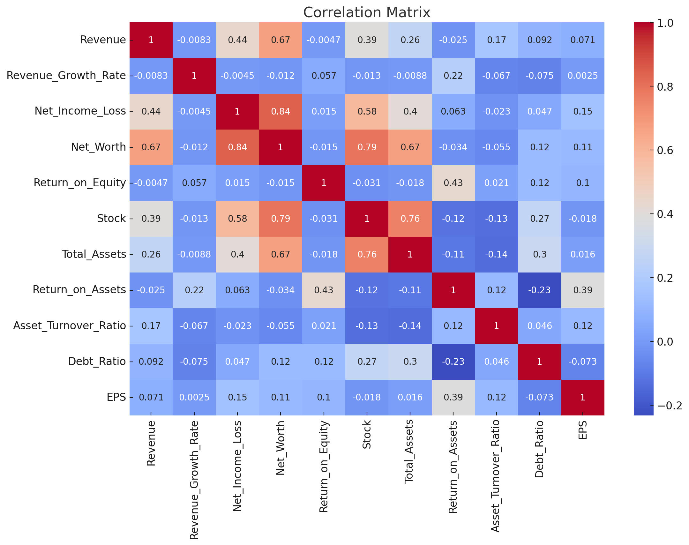
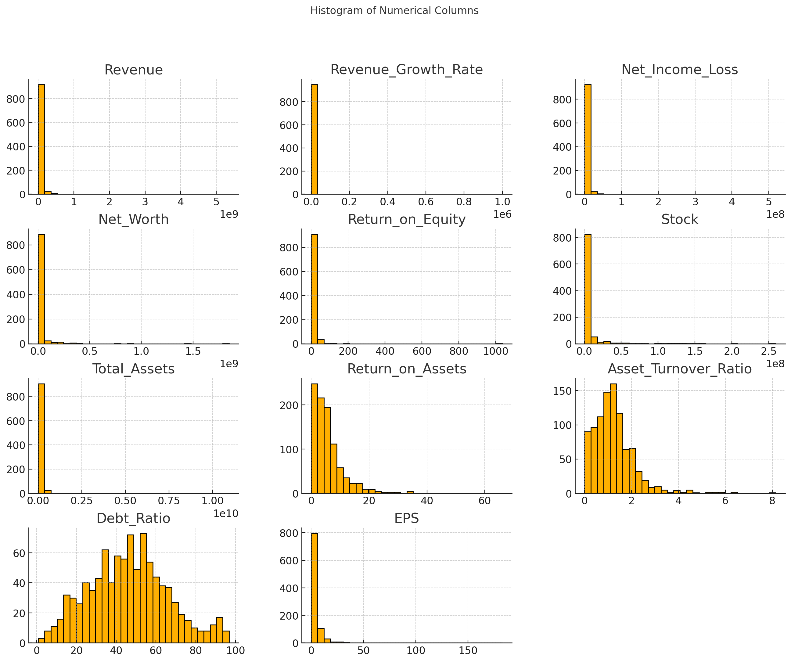

# Data Analysis
## Data Cleaning and Preparation:

Successfully renamed columns and converted numerical data to appropriate types.
Handled missing values using mean imputation.
Verified data integrity by checking for duplicates and ensuring no missing values remain.

## Analysis:

Conducted correlation analysis to understand relationships between variables.
Analyzed the distribution of numerical data to identify patterns and potential anomalies.

### Observations:
Correlation Matrix: The correlation heatmap reveals the relationships between various numerical columns, indicating which variables are strongly or weakly correlated.

Distribution Analysis: The histograms provide insights into the distribution of each numerical column, highlighting any skewness or outliers.

