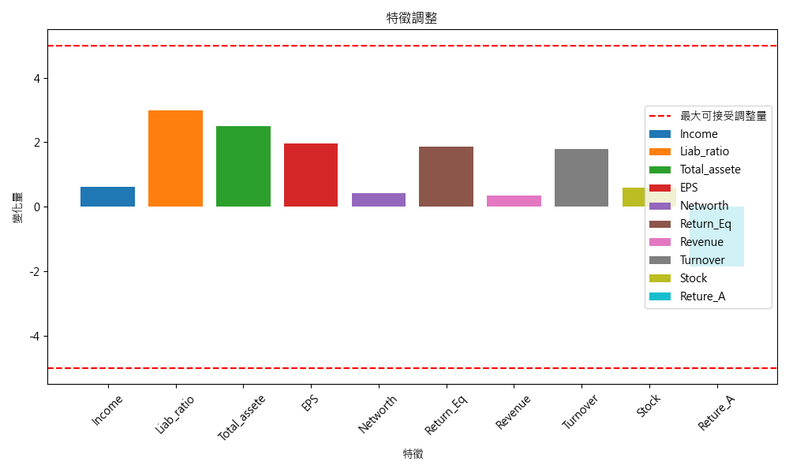

# 利用回歸模型判斷如何調整


## 簡介
訓練回歸模型，並對資料預測後，計算決策平面來尋找參數調整的方向。

## 讀入資料並訓練模型
```python
# 讀取訓練資料
train_data = pd.read_csv("dataset/Top100_final.csv", encoding='utf-8')

# 選取特徵和目標變量
X_train = train_data.iloc[:, 2:12]  # 第2到第11列為特徵
y_train = train_data['Top 100']     # 目標欄

# 標準化訓練資料
scaler = StandardScaler()
X_train_scaled = scaler.fit_transform(X_train)

# 訓練模型
logreg = LogisticRegression(max_iter=10000)
logreg.fit(X_train_scaled, y_train)
```
## 
-
```python
# 獲取決策邊界的係數和截距
coefficients = logreg.coef_[0]
intercept = logreg.intercept_[0]
```

## 計算調整特徵
計算點和決策平面的距離來確定需要調整的特徵值。當決策值為負數時，表示模型認為他不是Top100的機率很高，所以要將他往正數修。
這不是一個很好的方法，
- 其中decision_values[i]就是該特徵值對應決策平面特徵值的差距
- 可自行設定特徵的變動限制，舉例希望Reture_A(其實應該式Return_A，資料誤植)和Return_Eq (ROA和ROE)的變動不要超過5，其他的不要超過4
```python
# 計算需要改變的特徵值
def calculate_feature_changes(data_x, coefficients, intercept, scaler, max_change=10, max_return_change=5):
    data_x_scaled = scaler.transform(data_x)
    decision_values = np.dot(data_x_scaled, coefficients) + intercept
    
    changes = np.zeros_like(data_x_scaled)
    for i in range(len(data_x)):
        if decision_values[i] >= 0:
            continue  # 如果達標，不需要調整
        for j in range(len(data_x.columns)):
            required_change = (0 - decision_values[i]) / np.abs(coefficients[j])
            if j in ['Retur_A', 'Return_Eq']:
                if np.abs(required_change) > max_return_change:
                    # 最多只能跟限制的一樣多
                    changes[i][j] = np.sign(coefficients[j]) * max_return_change * scaler.scale_[j]
                else:
                    changes[i][j] = required_change * np.sign(coefficients[j]) * scaler.scale_[j]
            elif np.abs(required_change) > max_change:
                # 最多只能跟限制的一樣多
                changes[i][j] = np.sign(coefficients[j]) * max_change * scaler.scale_[j]
            else:
                changes[i][j] = required_change * np.sign(coefficients[j]) * scaler.scale_[j]
    
    changes_scaled = changes / scaler.scale_
    
    return changes_scaled*0.3 # 縮放一點 不然數字太誇張
```

## 結果
### Notice : 由於訓練模型是尺用那坨訓練資料的StandardScaler標準化過的模型,所以輸入需為被同一個"標準化器"的資料,同樣地,轉換回去也要用相同的"標準化器"Inverse Transform


