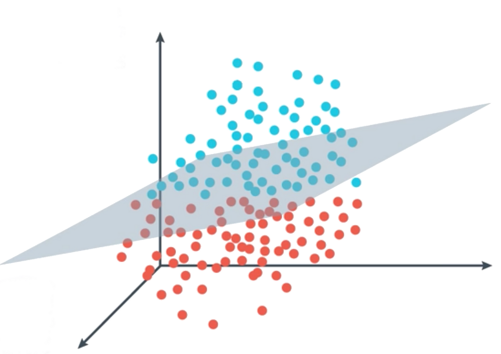
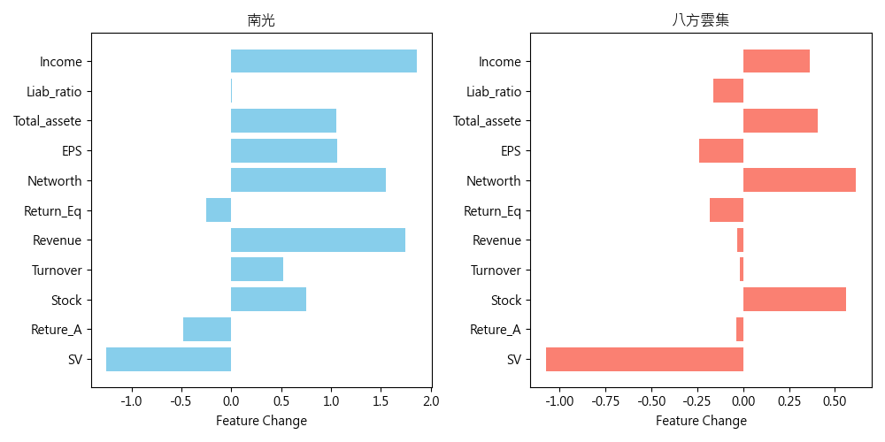

# SVM模型訓練與特徵調整

### 介紹如何使用支持向量機（SVM）模型進行訓練，並計算模型決策邊界，判斷特徵資料中的公司特徵做什麼樣的變動，能讓公司有機會進前百大。

## 讀取資料

首先，我們讀取了訓練數據和測試數據，並移除了不必要的欄位（例如 'N_name' 和 'Name'）。

```python
import numpy as np
import pandas as pd
from sklearn.model_selection import train_test_split
from sklearn.preprocessing import StandardScaler
from sklearn.svm import SVC
import matplotlib.pyplot as plt

data = pd.read_csv('dataset/Top100_final.csv')
wanna_know_data = pd.read_csv('dataset/test_cody.csv')

data = data.drop(columns=['N_name', 'Name'])
wanna_know_data = wanna_know_data.drop(columns=['N_name', 'Name'])
```


## 根據建模時的經驗(詳情請見SVM_Read.md)選擇參數並訓練模型
```python
# 標準化
scaler = StandardScaler()
X_train_scaled = scaler.fit_transform(X_train)
X_test_scaled = scaler.transform(X_test)
wanna_know_data_X_scaled = scaler.transform(wanna_know_data_X)

# 訓練SVM模型
svm_classifier = SVC(kernel='rbf', C=7, gamma=0.3, probability=True)
svm_classifier.fit(X_train_scaled, y_train)
```


## 尋找決策超平面，控制調整量

- 向量機的決策函數通常為𝑓(𝑥)=𝑤⋅𝑥+𝑏
    - 𝑤是分隔超平面的法向量 
    - x是特徵向量(超空間中一個點) 
    - b是截距
- 決策函數若return負值，表示此特徵是反例(不是Top100的那側)
- 梯度 ∇𝐿 表示目標函數 𝐿 對於模型參數的變化率，粗略來說就是對 𝐿 微分。dual_coef可以幫我們得到 𝑤 的偏微分

```python
# 計算預測集中每個樣本的決策函數值
decision_values = svm_classifier.decision_function(wanna_know_data_X_scaled)

# 找出需要調整的樣本（假設我們想要將所有不是Top_100的樣本變成Top_100）
samples_to_adjust = wanna_know_data_X_scaled[decision_values < 0]

# 計算每個特徵的梯度
gradients = np.dot(svm_classifier.dual_coef_, svm_classifier.support_vectors_).flatten()

scale_shrink = 0.01

# 計算調整量
adjustments = scale_shrink * gradients * -decision_values[decision_values < 0].reshape(-1, 1)
```

## 結果整理和輸出
### Notice : 由於訓練模型是尺用那坨訓練資料的StandardScaler標準化過的模型,所以輸入需為被同一個"標準化器"的資料,同樣地,轉換回去也要用相同的"標準化器"Inverse Transform
### 這裡就不做資料逆標準化,直接呈現模型說明這樣改變的化就有機會進Top 100

```python
# 計算調整後的特徵值
adjusted_samples = samples_to_adjust + adjustments

# 印出調整後的特徵值
print("\n調整後的特徵值:")
print(pd.DataFrame(adjusted_samples, columns=wanna_know_data_X.columns))
```